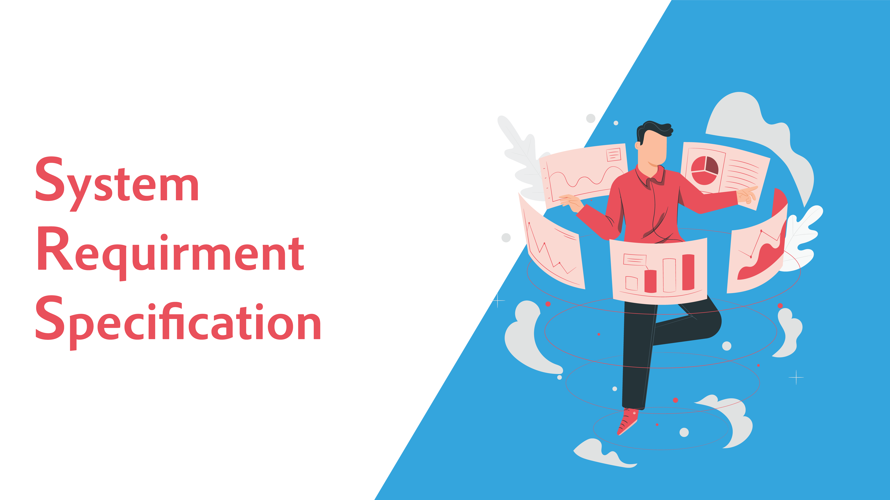
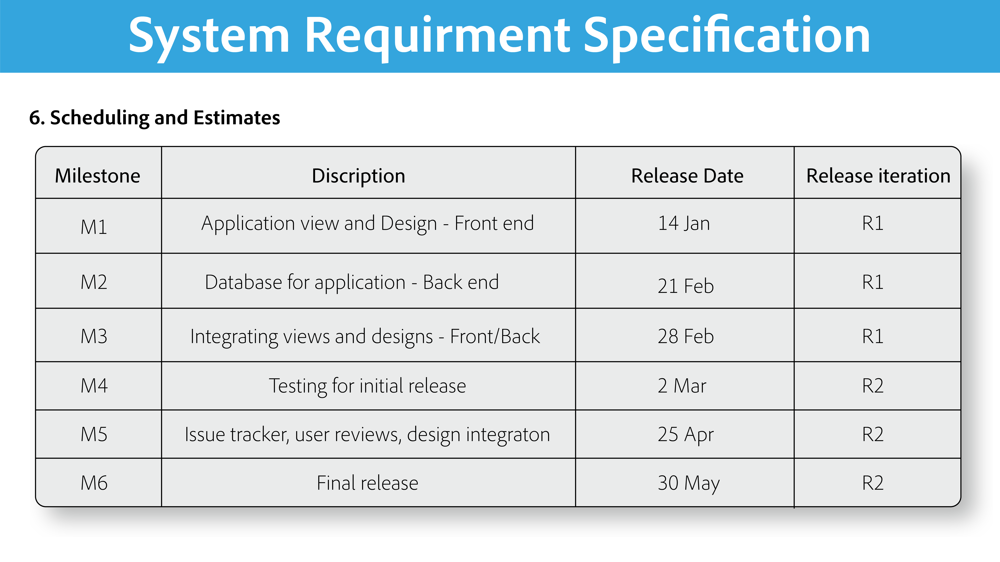

# A classroom notes archive
The idea of Anavrin came in when was our exam time and everyone including me is rushing around to get class notes and no one is around to tell what topics we actually need to go through. Ergo comes Anavrin, the archive.

# Landing page
Home page, here you can navigate to **join us**, you can veiw **about** and **team** to know more about project and owner, lastly all pages have **Dark-Light** mode for comfortable viewing experience. 

# Loggin page
Here you can by loggin in with your registered email and password. Or you can register to login to website.
While logging in, users are allowed to choose between **Student** or **Teacher**, and only an **admin** can assign other user as admin or **Subject Expert** who will primarily post notes, all subjects will have atleast 1 subject expert and we can have as many.

This loggin is made successfull by using mySQLi v7.4.5 which is locally hosted by Apache2.4.43, and connection is made possible by php v7.5.4
Further are stated details about the local host:  
Server: 127.0.0.1 via TCP/IP  
Server type: MariaDB  
Server connpngction: SSL is not being used Documentation  
Server version: 10.4.11-MariaDB - mariadb.org binary distribution  
Protocol version: 10  
User: root@localhost  
Server charset: UTF-8 Unicode (utf8mb4)

# Select your archive
Here you are promted to select the archive of your choice, by entering your Semester and Course ID, you can enter date if you want archive of a specific date or you can leave it blank it will automatically fetch the day 1 of that course so you can read/study all the entries sequentially, it comes in handy during exam prepration when we study everything from the starting.

# The archive
Finally we have the required archive, it is scrollable .txt to html implementation using fetch.
Users are free to rate the readability of the archive for subject experts to improve further.

# 1. Source Information
Here we get the information about the source which includes who uploaded it, the teacher who taught the content and its date, this section is solely for credit purpose.

# 2. File Exlorer
Here the user can easily navigate to different to different archives via date or course name.

# 3. Personal Notes
This is the most important section, here the user can make there own notes out the archive and save the suitable or important information for themselves.

# 4. Community
Here users can ask doubts or propose changes in the archive and help fellow students with there issues with respect to this very archive.

**1. Introduction**   
This document lays out a project plan for development of “Anavrin” an open source classroom notesmanagement system by **Rahul Gaur**.
  
he intended reader of this document are current and future developers working on “Anavrin” and spectators
of the project. This plan will include, but not restrict to, a summery of the system functionality, the scope of the
project from perspective of the “Anavrin” team (me and my mentors), scheduling and delivering estimates, 
project risks, and how those risks will be mitigated, the process by which I will develop the project, and 
metrics and measurments that will be recorded through out the project.
  
**2. Purpose**
  
Managing notes on day to day basis is on hell of a job, missing your note book even for a day will create 
back-log for a week. It is almost impossible to write everything we are taught, we tend to miss more than a
couple points our teacher verbally teach us, and all this becomes much more worse when exams are nearby
so wouldn’t that be nice if multiple student prepare same note and share it to rest of the class!
  
Anavrin being an online community will be free for anyone to publish thier own notes, and we will have 
students as subjects experts who will keep close attention to subjects make sure notes are updated and are
correct, It will have discussion tab to point out errors and doubts on the go.
  
**2.1 Customers**
  
Anyone who can use this web-application, though the content is best suited for college students.
  
**2.2 Functionality**
  
1. Users should be able to loggin through the account the created on this web-app, they are given tags such as teacher, student, subject-experts and admin. 
2. They should be able to share PDFs, and document related photos, and video links. 
3. Users can ask doubts in the discussion tab for more clearity. 
4. Teachers can go through the last dated study material of respected  course to check what has been taught yet and what is yet to be taught.  
**2.3 Platform**
It will be launched as a Web-based application, works as long as you have a web-browser.
**2.4 Development Responsibility**
	 I, Rahul Gaur, would be developing the software and I am responsible for the creation of the 
	 Database, front-end designing, back-end and all the other related stuffs.
**3. Goals and Scopes**
	 Goal is to provide students a reliable web-community to get notes from their own classroom quickly
	 even when thier friends are busy prepairing thier own exams, Anavrin will be open at any time of day to get
	 notes instantly, though goals and scope are not limited to this, they can also get thier doubts cleared.
   **4. Deliverables**
	 I’ll deliver the following during the course of development:
		             Feature specification
					 Product design
					 Test plan
					 Development document
					 Source code
**4. Risk management**
	**4.1  Risk Identification**
			Risk identified till now is that we already have Geeksforgeeks.org, tutorialpoint.com where they already have
			lots of information, study material about what we are taught in the class.
  **4.2 Risk Mitigation**
	 Even though lots of students already use online portals like Geeksforgeeks.org, Udemy.com etc but my 
	 platform is still going to have a major upper hand that is that these websites have tons of information and most
	 of them are not relevent to our course of study, or exam perspective.
	Content on Anavrin is strictly bounded to classroom only, so students get to know what specific topics are
	 taught, and all the relevent information, notes, notices are present under thier class subheading.
	 Students need not to sort and arrange topics first, they can just loggin to their class and everything is already
	 present their, either for quick refrence or exam prepration.
	 Thus, I think that there is a considerable amount of difference between Geeksforgeeks.org, Udemy.com etc
	 and my application and it would attract many students.

