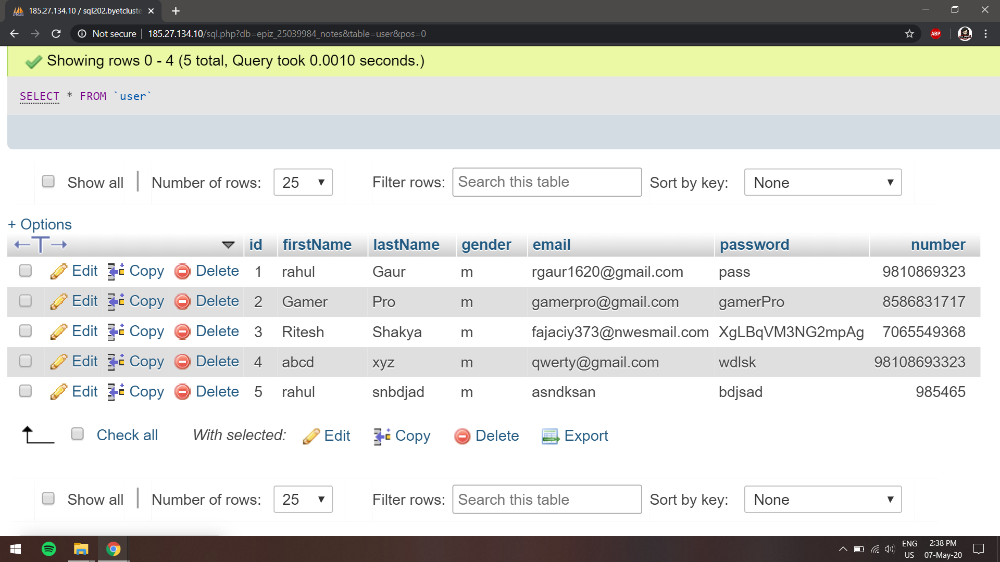

# A classroom notes archive
The idea of Anavrin came in when was our exam time and everyone including me is rushing around to get class notes and no one is around to tell what topics we actually need to go through. Ergo comes Anavrin, the archive.

# Landing page
Home page, here you can navigate to **join us**, you can veiw **about** and **team** to know more about project and owner, lastly all pages have **Dark-Light** mode for comfortable viewing experience. 

# Loggin page
Here you can by loggin in with your registered email and password. Or you can register to login to website.
While logging in, users are allowed to choose between **Student** or **Teacher**, and only an **admin** can assign other user as admin or **Subject Expert** who will primarily post notes, all subjects will have atleast 1 subject expert and we can have as many.

This loggin is made successfull by using mySQLi v7.4.5 which is locally hosted by Apache2.4.43, and connection is made possible by php v7.5.4
Further are stated details about the local host:  
Server: 127.0.0.1 via TCP/IP  
Server type: MariaDB  
Server connpngction: SSL is not being used Documentation  
Server version: 10.4.11-MariaDB - mariadb.org binary distribution  
Protocol version: 10  
User: root@localhost  
Server charset: UTF-8 Unicode (utf8mb4)

# Select your archive
Here you are promted to select the archive of your choice, by entering your Semester and Course ID, you can enter date if you want archive of a specific date or you can leave it blank it will automatically fetch the day 1 of that course so you can read/study all the entries sequentially, it comes in handy during exam prepration when we study everything from the starting.

# The archive
Finally we have the required archive, it is scrollable .txt to html implementation using fetch.
Users are free to rate the readability of the archive for subject experts to improve further.

# 1. Source Information
Here we get the information about the source which includes who uploaded it, the teacher who taught the content and its date, this section is solely for credit purpose.

# 2. File Exlorer
Here the user can easily navigate to different to different archives via date or course name.

# 3. Personal Notes
This is the most important section, here the user can make there own notes out the archive and save the suitable or important information for themselves.

# 4. Community
Here users can ask doubts or propose changes in the archive and help fellow students with there issues with respect to this very archive.

